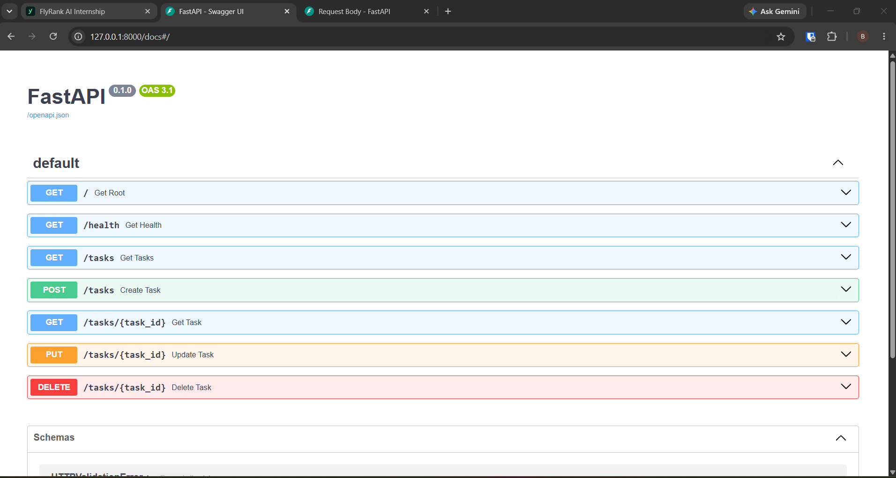
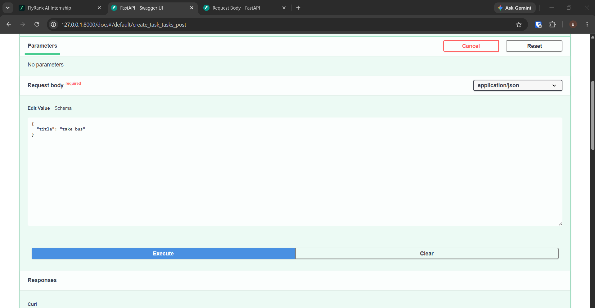
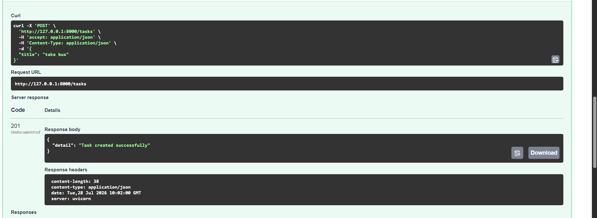

# CRUD API

This is a small FastAPI project for managing a simple to-do list. It was built for the FlyRank AI Internship, Week 2, Assignment A1.

The app keeps everything in memory, so there is no database involved. That makes it easy to run and test, but it also means the task list resets whenever the server restarts.

## What it does

- Create new tasks
- View all tasks
- View a single task by ID
- Update an existing task
- Delete a task
- Check the API health status

## How to run it

If you are using Windows, run the app with these steps:

```bash
python -m venv .venv
.venv\Scripts\activate
pip install fastapi uvicorn
uvicorn main:app --reload --port 8000
```

Once the server is running, open `http://localhost:8000` in your browser to confirm it is working. You can also visit `http://localhost:8000/docs` to try the API through Swagger UI.

## Endpoints

## | Method | Path | Purpose

| GET | `/` | Basic API info  
| GET | `/health` | Health check  
| GET | `/tasks` | Get all tasks  
| GET | `/tasks/{id}` | Get one task  
| POST | `/tasks` | Create a new task
| PUT | `/tasks/{id}` | Update a task  
| DELETE | `/tasks/{id}` | Remove a task

## Example

To add a task with `curl`, use:

```bash
curl -i -X POST http://localhost:8000/tasks -H "Content-Type: application/json" -d "{\"title\":\"Buy milk\"}"
```

## Screenshots




